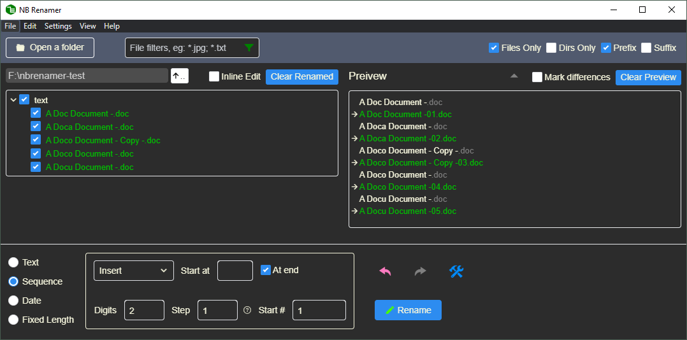

# Why another batch renaming tool?
NB Renamer started as a personal tool to help tidy up file names, especially the downloads ;). There are many free bulk renaming software on the internet, but like most users, I just need an easy-to-use gadget, not an aircraft cockpit. So bearing the KISS (Keep it Simple, Stupid) principle, it's definitely not the one with the most functions, but I hope you'll enjoy its

- **Minimal & Dynamic interface**

- **Intuitiveness and interactivity**
  - Auto preview any changes before the real renaming
  - Populate the values for you at the mouse cursor's position or selection

- **One-click install, and other [features](public/help/releases.md)**...

Some useful links:
- [Documentation](public/help/tips.md)
- [Feature request / issues](https://github.com/hermit99/nbrenamer/issues)

Or you can directly [contact me](mailto:nbrenamer@gmail.com). I'm keen to hear your feedback and make it better!

# Your support is appreciated!
NB Renamer is currently a [freeware](https://en.wikipedia.org/wiki/Freeware) (Free as in Beer), but it'll also become open source (Free as in Speech) in the future if people like you are so kindly to [Buy me a coffee](https://www.buymeacoffee.com/bl5s3cxyr) to support this software.