# NB Renamer
[TOC]
# Quick Start
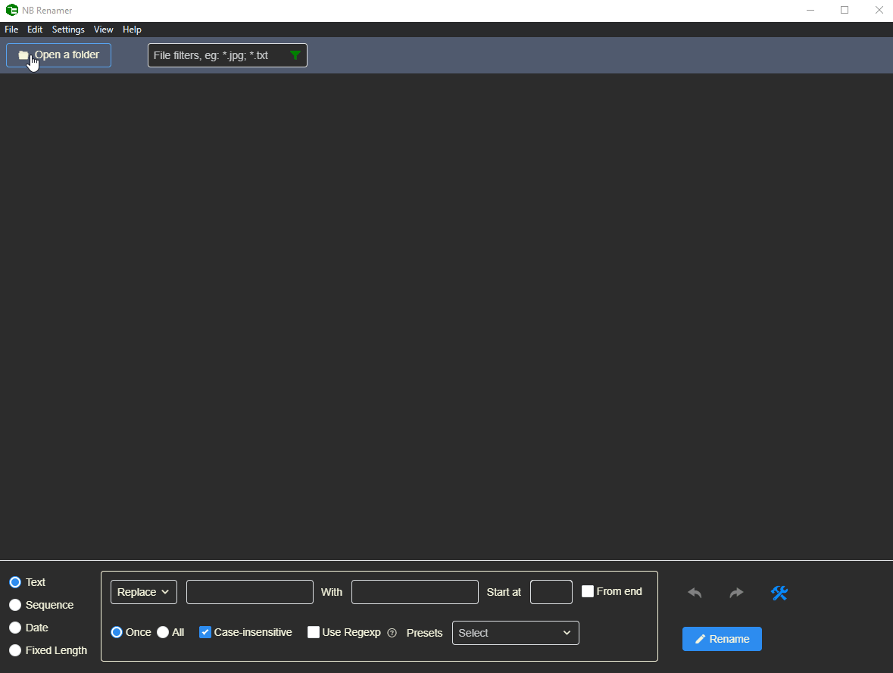

# User Interface
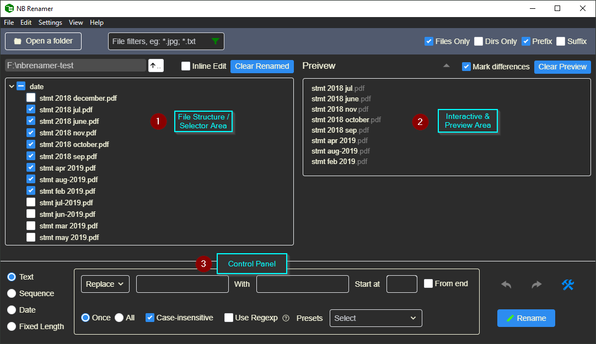

1. **Selector Area** - Shows folder structure. You can select the files to work on.
2. **Preview Area** - Two-way interaction. 1) Changes in the Control Panel will be reflected in the Preview area. 2) Clicking or selecting file names populates values back to the Control Panel.
3. **Control Panel** - Controls how you want the files to be named.

## Light Theme
You can choose the light theme in settings if you don't like the default dark theme. ☛ [General](#general)

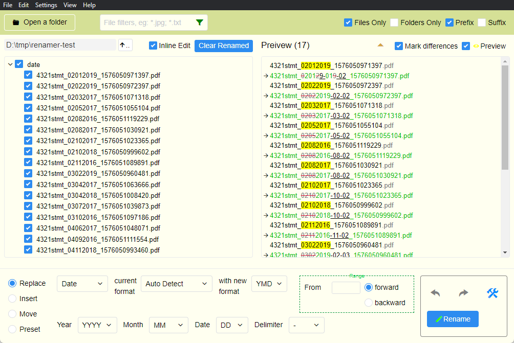

# Basic Functions
## Interactivities
- **Click on file name** - Get cursor's position
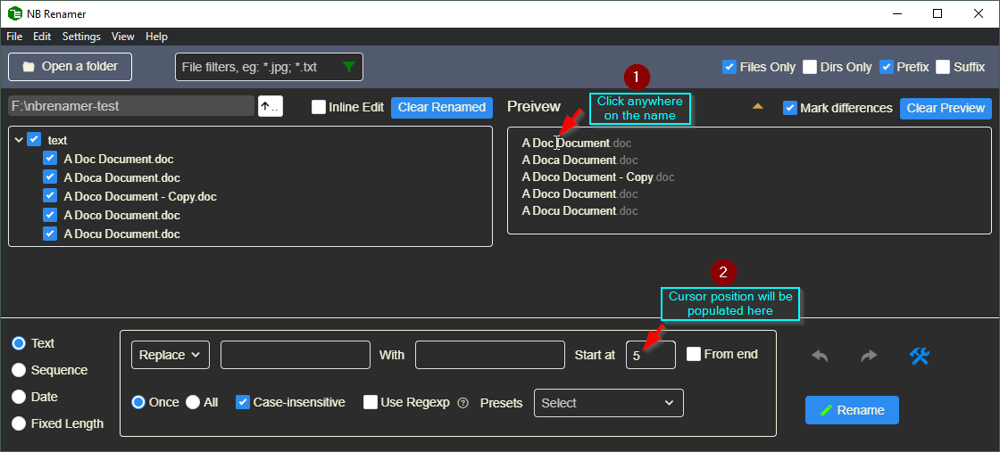
- **Select on file name** - Copy the selected letters and the starting position
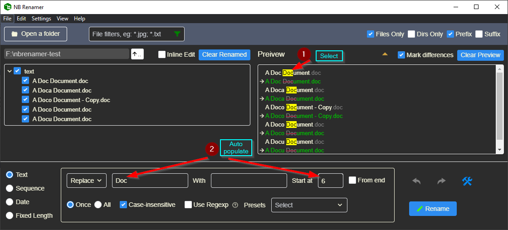

- **Mark differences** - Shows what will be deleted / added to the original name
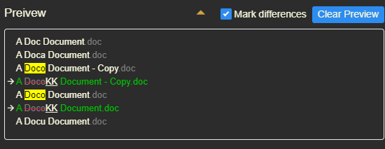  
Turning off Mark differences will just show the end result
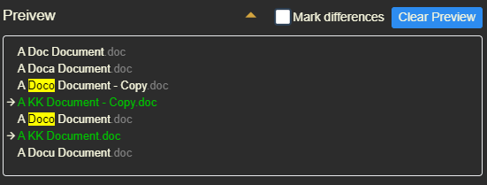  

## Batch Renaming
### Types
* **[Text](#text)** - Generic text manipulation that caters for most use cases.
* **[Sequence](#sequence)** - Insert / re-sequence sequence numbers.
* **[Date](#date)** - Reformat dates.
* **[Fixed Length](#fixedlength)** - Replace some characters at fixed positions.

> **Tips:** You don't have to do the renaming all in once, but can do it step by step combining those types. Undo or redo if the results are not satisfactory.

### Common Parameters
The following two positioning parameters are common to all types as they indicate where you want to start and in which direction.
- **Start at**  
Search from this index / position. When From end is ticked, it becomes negative numbers to denote that the direction is from right to left.  
  > **Tips:💡** You don't have to count this number, click at the postion on the file name in Preview pane will get the value for you automatically.

- **From end** - Match from the end of the name, i.e. from right to left. Or insert at end.  
If not selected, it matches from the beginning of the text. E.g. the first *doc* is matched:
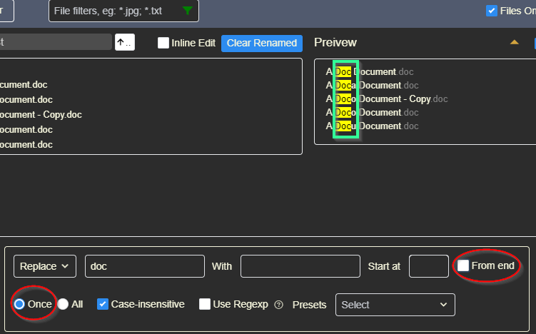
While matching from end, the last *doc* is matched:
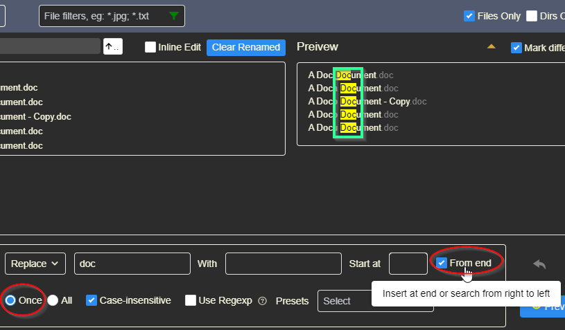

### Text
Most generic renamings can be handled here.
#### Operations
- **Replace**  
Replace some words with other. **Delete** is also handled here as it can be deemed as replacing with empty.
- **Insert**  
Insert new word at particular position.
#### Presets
We built in some predefined rules for your convenience, such as:  
- **Remove unnecessary chars**  
  E.g. Quickly clean up:
  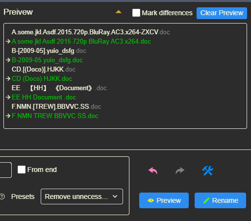

- **Capitalize 1st Letter**
- **all lowercase**
- **ALL UPPERCASE**
> **Good News**: You'll soon be able to customize and define your own rules in future releases. I believe this feature is particularly userful for advanced users.

#### Parameters
- **[Replace / Insert] Text**  
The text to be replaced / inserted.  
  >*Advanced💡: Can be a Regexp if Use Regexp is ticked.*
- **With (replacement)**  
The text to replace the above.  
- **All** - Replace all matches
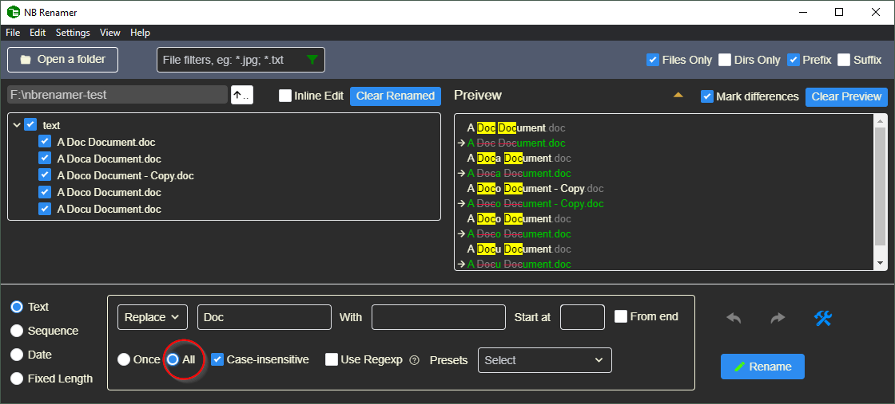

- **Case-insensitive**
Untick if you want case-sensitive matches.

- ***Use Regexp*** - *advanced*
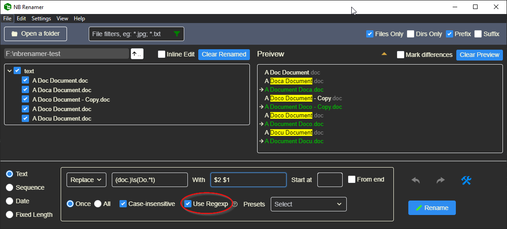

> **Tips💡:**
> 1. Don't put starting and tailing / in the Regexp
> 2. Don't put /gi in the Regexp, tick All for /g and Case-insensitive for /i

### Sequence
If you want to insert / delete or re-sequence a number in the file names.
#### Operations
- **Re-Sequence**  
Re-generate a sequence to replace existing sequence in file names.  
**When Digits is 0, it means to *DELETE* the sequence found.**
- **Insert**  
Generate a new sequence at particular position in file names
#### Parameters
- **Digits**  
Minimum sequence digits. E.g. Digits is 3, then sequence 1 will be padded with 0s like `001`.  
**When Digits is 0, it means to *DELETE* the sequence found.** In *Insert* operation, Digits always >= 1.
- **Step**  
The increment / decrement step of the start number. E.g. Start is 1, Step is 2, then the sequence will be `1, 3, 5`...  
When Step is negative, i.e. decrement, the app will guess a Start number so that the last file in the sequence still has a positive number. Just set the Start manually if that's not what your want.  
**When Step is 0 in *Re-Sequence*, it means to adjust the sequence digits only.**  
E.g. current sequence in file names is `1, 2, 3`..., and Digit is 3, Step is 0, then the new sequence will be `001, 002, 003`...  
- **Start**  
The starting value of the sequence.

### Date
Find the dates element in file names and reformat them.

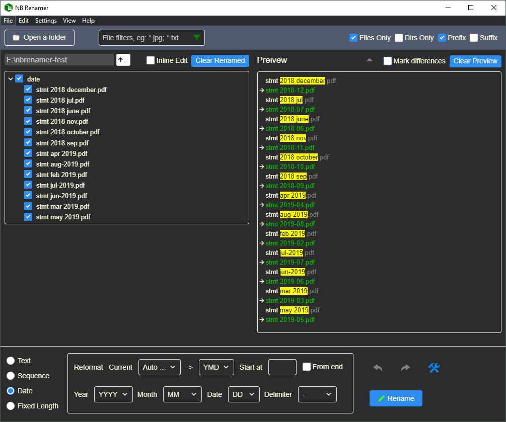
#### Parameters
- **Current format (order)**  
Auto Detect should work most of the times. However can specify from the dropdown list if it's confusing.
- **-> (New order)**  

The second row is the new format settings.
- **Year**  
4 digits / 2 digits / no year  
- **Month**  
2 digits / 3-letter abbreviation (eg. Aug) / full name / no month
- **Date**  
2 digits (with leading 0 if necessary) / 1 digit (no leading 0)
- **Delimiter**  
`- . _ (Space)`

> Currently Date type only supports English locale and the above four Delimiters. For other delimiters, you'll have to first replace it with one of the supported Delimiters and then change it back after the dates re-formmating.

### FixedLength
The Fixed Length type is for file names that have the same position patterns to work with, compared to dealing with wording patterns in Text type.  
E.g. you want to delete the first 5 letters from these files:

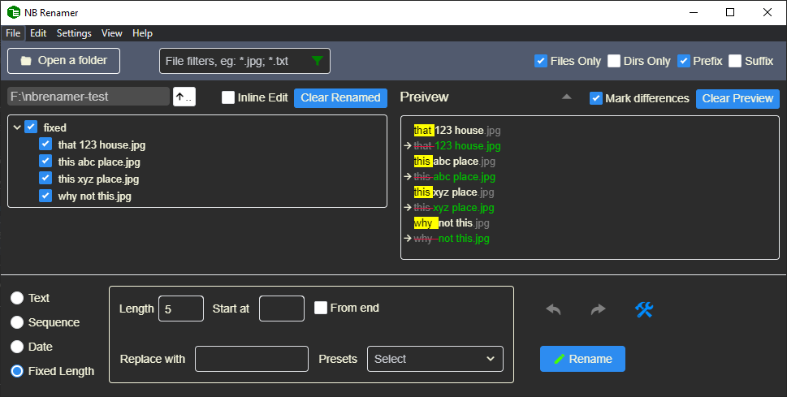

Or you want to captalize the last 5 letters:

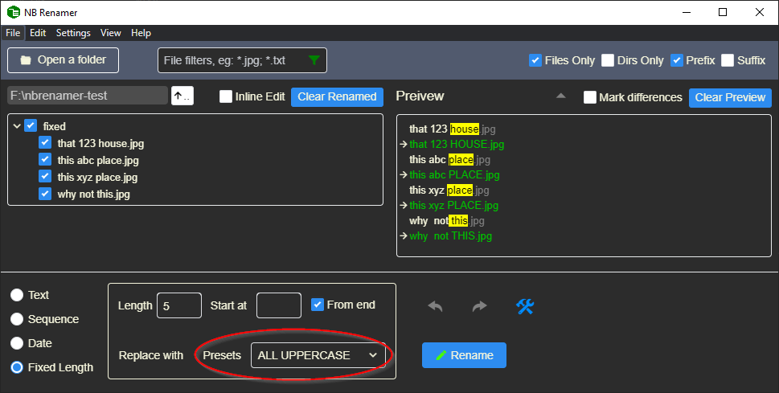

## Batch Renaming Using a CSV File
In some cases, you may find it convenient to define just a comma / tab delimitered file for batch renaming, especially when there is weak / no pattern in the names.
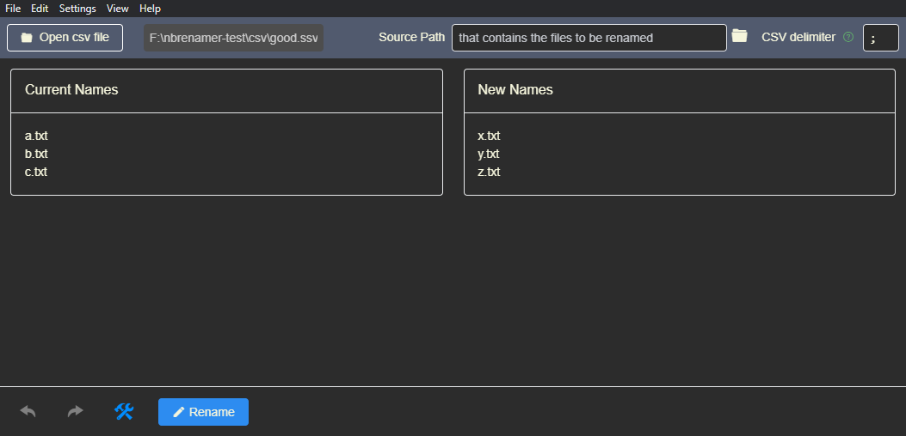

### Switch to CSV mode
In menu `Settings -> Use file list (csv)`. To switch back, go `Settings -> Normal rename`.
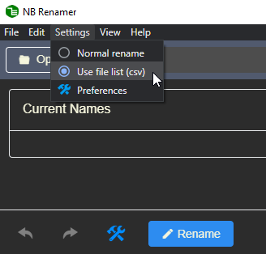

### CSV format
The file needs to have two fields, without a header line:
> Current File Name, New File Name  
...

For example:
> a.txt,x.txt  
b.txt,y.txt  
c.txt,z.txt

### Delimiters
` , (Tab) ; |  ` etc. can be automatically recognized. You can also specify it here:
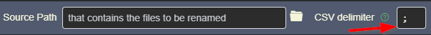

## Adhoc Renaming
Tick the Inline Edit, you can directly edit the file names in a much quicker way than Windows Exploer.

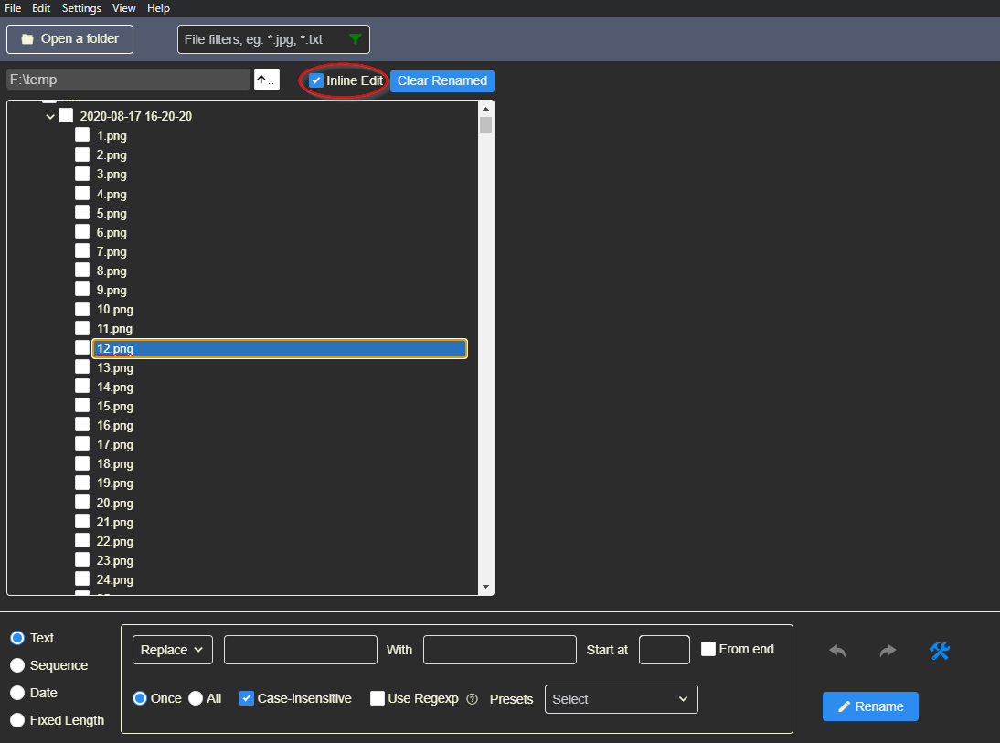

# Preferences
Access Preferences via `Settings -> Preferences` menu or the  button in app's Control Panel.
## General
- Theme  
Choose between built-in Dark and Light themes.  
- Auto Preview  
Automatically preview the result when any changes are made. Suggest to turn on.
- Sort Alphanumericly  
It looks more natural to have an alphanumeric order of A1, A2, A3, A10 than A1, A10, A2, A3. Suggest to turn on.
- Reset to default  
Restore default settings.

