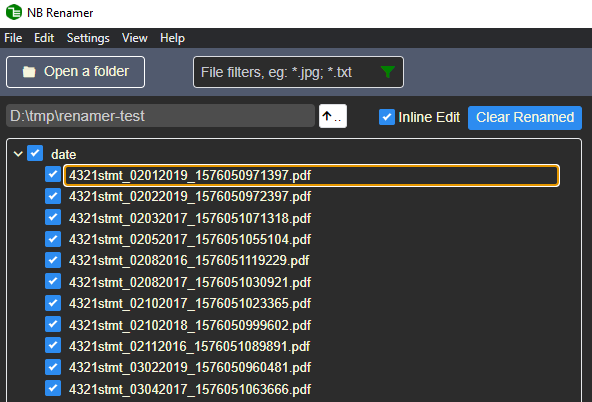

# NB Renamer <!-- omit in toc -->

- [Quick Start](#quick-start)
- [User Interface](#user-interface)
  - [Directory Navigation](#directory-navigation)
  - [Multiple File Selection](#multiple-file-selection)
  - [Preview Panel Interactivities](#preview-panel-interactivities)
  - [Light Theme](#light-theme)
- [Operations](#operations)
- [Parameters](#parameters)
  - [Range](#range)
  - [Types](#types)
    - [Text](#text)
    - [Section](#section)
    - [Sequence](#sequence)
    - [Date](#date)
- [Batch Renaming Using a CSV File](#batch-renaming-using-a-csv-file)
  - [Switch to CSV mode](#switch-to-csv-mode)
  - [CSV format](#csv-format)
  - [Delimiters](#delimiters)
- [Adhoc Renaming](#adhoc-renaming)
- [Preferences](#preferences)
  - [General](#general)

## Quick Start

## User Interface

1. **Selector Area** - Shows folder structure. You can select the files to work on.
2. **Preview Area** - Two-way interaction.
   - Parameter changes in the Control Panel are previewed
   - Clicking or selecting file names populates parameters in the Control Panel
3. **Control Panel** - Operations and parameters that control how you want the files to be named

### Directory Navigation

- Go to the parent directory

- Go to the sub directory

### Multiple File Selection

To unselect multiple files, just repeat the above steps again.

### Preview Panel Interactivities

- **Click on file name** - Set the beginning of the range using cursor's position  
- **Right click on file name** - In *Move* operation, set the destination position using cursor's position  
- **Select on file name** - For text, it'll be the text to replace or move; for section, it'll set the section's start and length
- **Mark differences** - Shows what will be deleted / added to the original name
  
Turning off Mark differences will just show the end result  
  

### Light Theme

You can choose the light theme in settings if you don't like the default dark theme. ☛ [General](#general)

## Operations

- **Replace** - Replace text or section, re-sequence, re-format date.
- **Insert** - Insert text or sequence.
- **Move** - Move particular text or section within the file name.
- **Preset** - Replace part or whole name using preset rules such as lowercase.

> **Tips:💡** Renaming can be done in multiple steps combining those operations. Undo or redo if the results are not satisfactory.

## Parameters

### Range

Range defines the segment of file name that you would like to manipulate.

- **From** - the beginning of the range

  > **Tips:💡** You don't have to count this number, click at the postion on the file name in Preview pane will populate that value for you.
- **Length** (for Section only) - the length of a section

  > **Tips:💡** Select the section of the file name in Preview pane will populate the value for you.
- **forward** (default) - from the beginning, select farward (left-to-right)  
- **backward** - from the beginning, select backward (righ-to-left)  

### Types

#### Text

Replace / insert some text.  
  >*Advanced💡: Can be a Regexp if Use Regexp is ticked.*

- ***Use Regexp*** - *advanced*

> **Tips💡:**
>
> 1. Don't put starting and tailing / in the Regexp
> 2. Don't put /gi in the Regexp, tick All for /g and Case-insensitive for /i

#### Section

Previously called Fixed Length (v0.1). Handling by position instead of text.

#### Sequence

Insert / delete / replace sequence.

Parameters:

- **Digits**  
Minimum sequence digits. E.g. Digits is 3, then sequence 1 will be padded with 0s like `001`.  
**When Digits is 0, it means to *DELETE* the sequence found.** In *Insert* operation, Digits is always greater than 1.
- **Step**  
The increment / decrement step of the start number. E.g. Start is 1, Step is 2, then the sequence will be `1, 3, 5`...  
**When Step is 0 in *Re-Sequence*, it means to adjust the sequence digits only.**  
E.g. existing sequence in file names is `1, 2, 3`..., and Digits is 3, Step is 0, then the new sequence will be `001, 002, 003`...  
- **Start**  
The starting value of the sequence.

#### Date

Find the dates element in file names and reformat them.

- **current format**  
Auto Detect should work most of the times. However can specify from the dropdown list if ambiguous.
- **wiht new format**  
The new year/month/day format

- **Year**  
4 digits / 2 digits / no year  
- **Month**  
2 digits / 3-letter abbreviation (eg. Aug) / full name / no month
- **Date**  
2 digits (with leading 0 if necessary) / 1 digit (no leading 0)
- **Delimiter**  
`- . _ (Space)`

> Currently Date type only supports English locale and the above 4 delimiters. For other delimiters, you'll have to first replace it with one of the supported delimiters and then change it back after the dates re-formmating.

## Batch Renaming Using a CSV File

In some cases, you may find it convenient to define just a comma / tab delimitered file for batch renaming, especially when there are weak / no patterns in the names.

### Switch to CSV mode

In menu `Settings -> Use file list (csv)`. To switch back, go `Settings -> Normal rename`.  

### CSV format

The file just needs two columns:
> Current File Name, New File Name  
...

For example:
> a.txt,x.txt  
b.txt,y.txt  
c.txt,z.txt

**DO NOT** put a header line.

### Delimiters

`, (Tab) ; |` etc. can be automatically recognized. You can also specify it here:

## Adhoc Renaming

Tick the Inline Edit, you can directly edit the file names in a much quicker way than in Windows Explorer.

## Preferences

Access Preferences via `Settings -> Preferences` menu or the  button in app's Control Panel.

### General

- Theme  
Choose between built-in Dark and Light themes.  
- Auto Preview  
Automatically preview the result when any changes are made. Suggest to turn on.
- Sort Alphanumericly  
It looks more natural to have an alphanumeric order of A1, A2, A3, A10 than A1, A10, A2, A3. Suggest to turn on.
- Reset to default  
Restore default settings.
